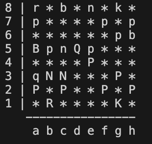

# Chess Game

A classic **Chess Game** implemented in Python, featuring two-player mode.

## Features

- Two-player mode (local multiplayer)
- All standard chess rules (castling, en passant, promotion)
- Move validation and check/checkmate detection

## Screenshots

  

## Installation

1. Clone the repository:

```bash
git clone https://github.com/adamalobousi/python-chess.git
cd python-chess.git
```

## How to play

1. Run the main file using Python:

```bash
python main.py
```
2. Choose gamemode. Enter 2 for interactive game and 1 for an example game

3. The game will start by displaying the board. White moves first.

4. Players take turns entering moves in this format: {starting square coordinate}{destination square coordinate} (e.g. e2e4, b8c6)

5. If an invalid move is entered, the player will be asked to enter again